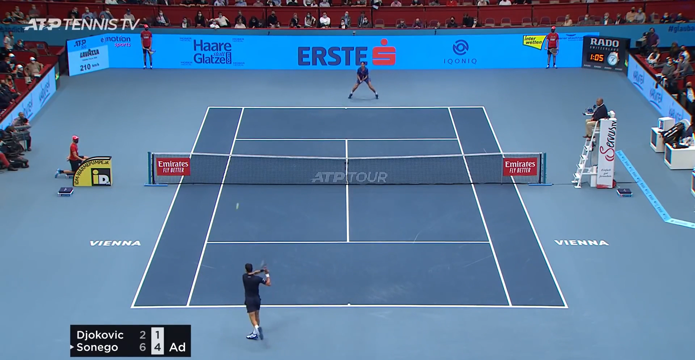
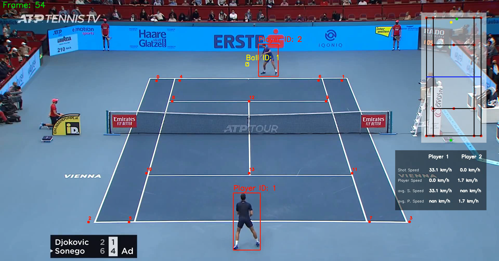

# Tennis Analysis 

## Overview 

Analysis is an important field in sport in order to understand the performance of the players and the ball.  

In this project, we are going to analyze the tennis game using YOLO and CNN backbone.

**Before analyzing:** 



**After analyzing:**



## Usages

- Track the players
- Tracks the balls 
- Find the court lines
- Find the mini court 
- Get the stats

## Pipeline 

- Training YOLOv5 with [tennis ball dataset](https://universe.roboflow.com/viren-dhanwani/tennis-ball-detection) to detect the ball. 
- Using YOLOv8 to track the players. 
- Using CNN backbone trained with `data/images/` to detect the court line.
- Calculating the distances in order to detect the ball and the player stats.

## Files structure 
```
├── analysis              <- where you get the analysis boards
├── constants             <- where you get your constant values 
├── court_line_detector   <- where you get the code lines of court line detecting 
├── data                  <- where you get the data
├── mini_court            <- where you get you mini-court 
├── runs                  <- demo from YOLO 
├── tracker_stubs         <- pickle files of trackers
├── trackers              <- lines of tracking codes
├── training              <- where you train you player and ball trackers
├── utils                 <- where you train you model with dataset
├── .gitignore 
├── LICENSE     
├── main.py
├── README.md
├── requirements.txt
├── yolo_inference.py
```

## Installation 
To run this repository, please follow these instructions: 

1. Clone this repository:
```
git clone https://github.com/lenam1072004/tennis-analysis.git
```

2. Install requirement packages: 
```
pip install -r requirements.txt
```
3. Put your video in the `PATH`

4. Change the input path in the main.py file 


3. Run the following command to transfer your video:
```
python main.py
```

4. See the video results at `data/vids` folder.


## License 

This project is licensed under the MIT License - see the [LICENSE](LICENSE) file for details.

## Contact 

If you want to contact me you can reach me at lenam1072004@gmail.com.